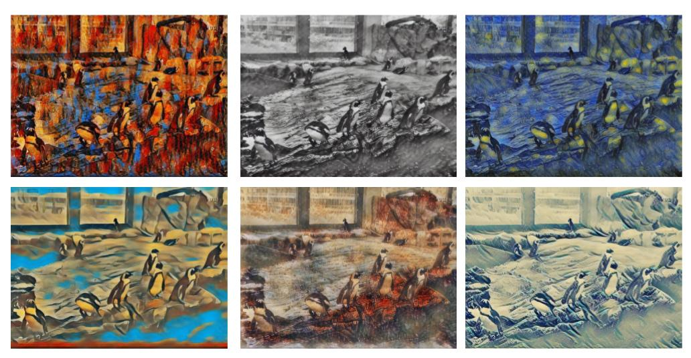
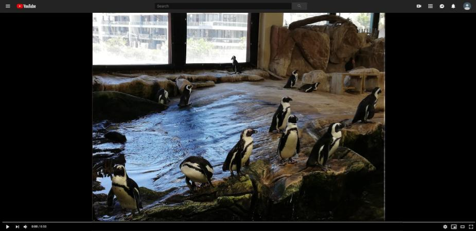

# Real Time Multi Style Transfer in Pytorch

Demo [](https://colab.research.google.com/github/ryanwongsa/Real-time-multi-style-transfer/blob/master/Real_time_multi_style_transfer_demo.ipynb)


My implementation in Pytorch of an adaption of the paper [A LEARNED REPRESENTATION FOR ARTISTIC STYLE](https://arxiv.org/pdf/1610.07629.pdf) (Vincent Dumoulin & Jonathon Shlens & Manjunath Kudlur).



#### Results on 16 different styles during training on an unseen image captured every 1000 steps for 2 epochs


#### Click the image below for a Youtube video link of transitions between styles:
<a href="https://www.youtube.com/watch?v=p1RYBBEYafA" target="_blank"></a>

## Requirements

Conda 3 installation of python 3
```
conda create --name <env> --file requirements.txt
```

## Implementation Details

The implementation uses Pytorch to train a deep convolutional neural network to be able to learn multiple art styles. The code implementation might not be an exact match of the paper by Vincent Dumoulin et al. as the training details and exact loss hyperparameters were not fully described. Each feature map in the network has two weights (`alpha` and `gamma`) dedicated to each style.

## Usage

Download the training dataset, using the coco dataset but can use any image dataset:
```
sh dataset/download_coco.sh
```

Training from scratch:
```
python trainstylenet.py --dataset-images {dataset_images} --styles-dir {styles_dir} --num-workers {num_workers} --model-dir {model_dir} --eval-image-dir {eval_image_dir} 
```

Inference
```
python inferstylenet.py --input-image ../bird.jpg --model-save-dir style16/pastichemodel-FINAL.pth --style-choice 4 --style-choice-2 5 --style-factor 0.5
```

Pretrained model and styles available [here](https://drive.google.com/drive/folders/1BFszn2tQdrVPeovpu5utY6XpQ4gkA96_?usp=sharing) 

There are 16 styles in the pretrained model. It is possible to use transfer learning to only learn the `alpha` and `gamma` weights as described in the paper but results seemed to have a similar convergence rate without transfer learning. The transfer learning method is available in `train/Trainer.py` using the method `transfer_learn_model()`. 


## TODO

- [x] Implement the multi style transfer network
- [x] Save the model to an external location
- [x] remove left over training code from the notebook and put it into python files
- [x] create command to train instead of using the testing notebooks.
- [x] create the "transfer learning" approach described in the paper to train new styles only using the `alpha` and `gamma` weights
- [x] Apply fine-tune approach
- [x] Implement a webcam feed version
- [x] refactor training code into class
- [x] Fix bug with resblock
- [x] Document code
- [ ] Convert to ONNX model
- [x] Create Colab prediction implementation
